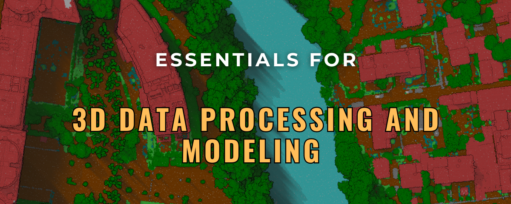

## Table of Contents
1. [Introduction](#introduction) 🎉
2. [Tools and Software](#tools-and-software) 🛠️
3. [Courses and Tutorials](#courses-and-tutorials) 📚
4. [Lectures and Seminars](#lectures-and-seminars) 🎤
5. [Project Examples and Case Studies](#project-examples-and-case-studies) 💼
6. [Community and Networking](#community-and-networking) 🌐
7. [Books and Literature](#books-and-literature) 📖
8. [Datasets](#Datasets) ✅
9. [3D tech startup](#3D-tech-startup) 🚀
10. [Contributing](#contributing) 👐

## Introduction

Welcome to "3D Point Cloud Essentials"! I've developed this repository as a comprehensive hub for anyone delving into the world of 3D point cloud technology. Whether you're a student, researcher, or industry professional, this repository aims to be your go-to resource. It encompasses a wide array of materials, including essential tools, foundational books, groundbreaking research papers, practical datasets, informative courses, and insightful lectures. The goal is to facilitate learning, research, and development in the dynamic field of 3D point clouds, providing resources that cater to various levels of expertise and interest.

## Tools and Software

This section provides a comprehensive list of tools and software for 3D point cloud processing, covering a range of functionalities from acquisition and processing to analysis and visualization. Both open-source and commercial options are included to cater to diverse needs and preferences.

### Open-Source Tools

| Tool | Description | Links |
| ---- | ----------- | ----- |
| PCL (Point Cloud Library) | A comprehensive library for 2D/3D image and point cloud processing. | [GitHub](https://github.com/PointCloudLibrary/pcl) \| [Website](http://pointclouds.org/) |
| CloudCompare | Specializes in 3D point cloud and mesh comparison and processing. | [GitHub](https://github.com/CloudCompare/CloudCompare) \| [Website](http://www.cloudcompare.org/) |
| Open3D | A toolkit for processing, visualizing, and analyzing 3D data. | [GitHub](https://github.com/intel-isl/Open3D) \| [Website](http://www.open3d.org/) |
| PDAL (Point Data Abstraction Library) | A C++ library for processing point cloud data. | [GitHub](https://github.com/PDAL/PDAL) \| [Website](https://pdal.io/) |
| laspy | A Python library for reading, modifying, and writing LAS files. | [GitHub](https://github.com/laspy/laspy) |
| plyfile | A Python library for reading and writing PLY files. | [GitHub](https://github.com/dranjan/python-plyfile) |
| MeshLab | An open-source system for processing and editing 3D triangular meshes. | [GitHub](https://github.com/cnr-isti-vclab/meshlab) \| [Website](http://www.meshlab.net/) |

### ML/DL

| Tool | Description | Links |
| ---- | ----------- | ----- |
| RandLA-Net | Efficient Semantic Segmentation of Large-Scale Point Clouds. | [Tensorflow](https://github.com/QingyongHu/RandLA-Net) |
| KPConv | Flexible and Deformable Convolution for Point Clouds. | [Tensorflow](https://github.com/HuguesTHOMAS/KPConv) \| [PyTorch](https://github.com/HuguesTHOMAS/KPConv-PyTorch) |
| Superpoint Transformer | Efficient 3D Semantic Segmentation with Superpoint Transformer. | [PyTorch](https://github.com/drprojects/superpoint_transformer) |
| SemanticML | A package for semantic segmentation of 3D unorganized point clouds using ML techniques. | [GitHub](https://github.com/Yarroudh/SemanticML) |

### 3D Modelling

| Tool | Description | Links |
| ---- | ----------- | ----- |
| 3dfier | The open-source tool for creating 3D models. | [GitHub](http://tudelft3d.github.io/3dfier) |
| City3D | Large-scale LoD2 Building Reconstruction from Airborne LiDAR Point Clouds. | [GitHub](https://github.com/tudelft3d/City3D) |
| val3dity | Validation of 3D primitives according to the international standard ISO19107. | [GitHub](https://github.com/tudelft3d/val3dity) |
| AdTree | Accurate, detailed, and automatic modeling of laser-scanned trees. | [GitHub](https://github.com/tudelft3d/AdTree) |
| Geoflow3D | Geoflow plugin for building LoD2 reconstruction from a point cloud. | [GitHub](https://github.com/geoflow3d) |
| PolyFit | Polygonal Building Surface Reconstruction from Point Clouds. | [GitHub](https://github.com/LiangliangNan/PolyFit) |

### Commercial Software

| Tool | Description | Links |
| ---- | ----------- | ----- |
| Leica Cyclone | Comprehensive software for point cloud processing in various industries. | [Website](https://leica-geosystems.com/products/laser-scanners/software/leica-cyclone) |
| Autodesk Recap | For 3D scanning and photogrammetry, creating 3D models from photographs and laser scans. | [Website](https://www.autodesk.com/products/recap/overview) |
| Faro Scene | Processes and manages scanned data, mainly from FARO scanners. | [Website](https://www.faro.com/en/Products/3D-Surveying/FARO-SCENE) |
| Agisoft Metashape | Photogrammetric processing of digital images and 3D spatial data generation. | [Website](https://www.agisoft.com/) |
| Pix4Dmapper | Professional photogrammetry software for drone mapping. | [Website](https://www.pix4d.com/product/pix4dmapper-photogrammetry-software) |

### Visualization and Analysis

| Tool | Description | Links |
| ---- | ----------- | ----- |
| ParaView | A multi-platform tool for data analysis and visualization. | [Website](https://www.paraview.org/) |
| Blender | A free and open-source 3D creation suite for modeling, animation, and rendering. | [Website](https://www.blender.org/) |
| COLMAP | Structure-from-Motion (SfM) and Multi-View Stereo (MVS) for scene reconstruction from images. | [Website](https://colmap.github.io) |

    

## Courses and Tutorials
A compilation of courses, tutorials, and lectures offering structured learning paths for all levels in 3D point cloud technology.

| Course Title | Link |
| ------------ | ---- |
| 3D Point Cloud In Cloudcompare |  |
| 3D Point Cloud In QGIS |  |
| 3D Modelling of the Built Environment |  |
| Photogrammetry I & II (2021, Uni Bonn, Cyrill Stachniss) |  |
| 3D Point Cloud and Machine Learning |  |
| Potree 3D |  |
| The Early Days of 3D Laser Scanning |  |
| Point Cloud Processing with Open3D |  |
| Photogrammetric Computer Vision |  |
| 3D Point Cloud Data Processing for SLAM |  |
| Open3D |  |

## Lectures and Seminars
Recorded lectures and seminars from field experts, providing insights into both industry trends and academic advancements.

## Project Examples and Case Studies
Showcases of practical applications and projects that utilize 3D point cloud technology, offering real-world examples and case studies.

## Community and Networking

The field of 3D point cloud technology is enriched by a vibrant community of professionals, enthusiasts, and researchers. Engaging with these communities can be invaluable for learning, collaboration, and staying abreast of the latest developments. Here are some key forums and platforms for networking and discussion:

### Specific Forums

- **CloudCompare Forum**
  - A dedicated forum for users of CloudCompare, where you can discuss issues, share tips, and get help from fellow users.
  - [CloudCompare Forum](http://www.cloudcompare.org/forum/)

- **Laser Scanning Forum**
  - A hub for professionals, enthusiasts, and newcomers to discuss everything related to laser scanning, including 3D point cloud processing.
  - [Laser Scanning Forum](https://www.laserscanningforum.com/forum/)

### Broader Online Communities

- **LinkedIn Groups**
  - LinkedIn hosts various groups focused on 3D scanning, LiDAR, and point cloud technologies, providing a platform for professional networking and knowledge sharing.
  - Search for groups related to "3D Scanning", "LiDAR", and "Point Cloud Technology" on LinkedIn.

## Books and Literature

The field of 3D point cloud technology is vast and intricate, requiring a solid understanding of various concepts and practices. This section lists books and literature that provide valuable insights and knowledge, beneficial for beginners and experts alike.

### Foundational Texts

- **"Computer Vision: Algorithms and Applications" by Richard Szeliski**
  - A comprehensive introduction to computer vision, including 3D point cloud data.
  - [Link to Book](https://www.springer.com/gp/book/9781848829343)

### Advanced Topics

- **"3D Deep Learning with Python" by Packt Publishing**
  - A hands-on guide to 3D deep learning, exploring PyTorch3D for processing 3D mesh and point cloud data.
  - [Link to Book](https://www.packtpub.com/product/3d-deep-learning-with-python/9781803247823)

- **"3D Point Cloud Analysis: Traditional, Deep Learning, and Explainable Machine Learning Methods" by Shan Liu, Min Zhang, Pranav Kadam, C.-C. Jay Kuo**
  - Comprehensive investigation of point cloud processing including traditional, deep learning, and explainable ML methods.
  - [Link to Book](https://link.springer.com/book/10.1007/978-3-030-89180-0)

- **"Reconstruction and Analysis of 3D Scenes: From Irregularly Distributed 3D Points to Object Classes" by Martin Weinmann**
  - Latest research on 3D point cloud generation, feature extraction, registration, and scene analysis.
  - [Link to Book](https://link.springer.com/book/10.1007/978-3-319-29246-5)

### Practical Guides

- **"3D Recording, Documentation and Management of Cultural Heritage" edited by Efstratios Stylianidis and Fabio Remondino**
  - Methods and technologies in 3D recording for managing and preserving cultural heritage.
  - [Link to Book](https://www.whittlespublishing.com/3D_Recording_Documentation_and_Management_of_Cultural_Heritage)

### Journals and Periodicals

- **ISPRS Journal of Photogrammetry and Remote Sensing**
  - A leading journal covering topics including point cloud processing.
  - [Journal Link](https://www.journals.elsevier.com/isprs-journal-of-photogrammetry-and-remote-sensing)

- **Photogrammetric Engineering & Remote Sensing (PE&RS)**
  - Articles and research on photogrammetry, remote sensing, and spatial information sciences.
  - [Journal Link](https://www.asprs.org/asprs-publications/pers)

This list is a starting point and is not exhaustive. Suggestions and contributions to this section are welcome.

## Datasets

### Annotated Point Cloud Datasets

| Dataset | Description | Links |
|---|---|---|
| **Paris-Lille 3D** | The Paris-Lille-3D is a Dataset and a Benchmark on Point Cloud Classification. The data has been produced by a Mobile Laser System (MLS) in two different cities in France (Paris and Lille). | [Website](https://npm3d.fr/paris-lille-3d) |
| **Toronto3D** | A large-scale point cloud dataset of Toronto, Canada, covering approximately 1 km of road and consists of about 78.3 million points.. | [Website](https://github.com/WeikaiTan/Toronto-3D) |
| **Semantic3D** | A point cloud dataset of 10 different urban environments, including parks, streets, and buildings. | [Website](http://semantic3d.net/) |
| **Wuhan Railway 3D** | A point cloud dataset of the railway network in Wuhan, China. | [Website](https://github.com/WHU-USI3DV/WHU-Railway3D) |
| **Saint Petersburg** | A point cloud dataset of Saint Petersburg, Russia. | [Website](https://github.com/lytkinsa96/Saint-Petersburg-3D-Dataset) |

### LiDAR Data Programs
This table provides an overview of various LiDAR data programs available in open access, highlighting their applications and the countries they cover. Each entry includes a direct link to access the data or learn more about the program.

| Dataset | Description | Country | Links |
|---------|-------------|---------|-------|
| **LiDAR HD - France** | High-definition LiDAR data. | France | [Website](https://geoservices.ign.fr/lidarhd) |
| **AHN - Actueel Hoogtebestand Nederland** | A detailed elevation dataset of the Netherlands, derived from LiDAR scans. Widely used for water management, urban planning, and environmental monitoring. | Netherlands | [Website](https://www.ahn.nl/) |
| **OpenTopography** | Provides access to high-resolution, Earth science-oriented, topography data, and tools, including LiDAR. | USA | [Website](https://opentopography.org/) |
| **Lidar Data - Geoscience Australia** | LiDAR data collection covering various regions of Australia, supporting environmental research and management. | Australia | [Website](http://www.ga.gov.au/scientific-topics/national-location-information/digital-elevation-data) |
| **UK Environment Agency LiDAR** | High-quality LiDAR data covering England, used for flood risk management and environmental assessment. | United Kingdom | [Website](https://environment.data.gov.uk/DefraDataDownload/?Mode=survey) |
| **Canadian Digital Elevation Model (CDEM)** | Derived from LiDAR and other sources, this dataset provides elevation data across Canada. | Canada | [Website](https://canadiangis.com/free-canada-lidar-data.php) |
| **New Zealand LiDAR** | High-resolution topographic data collected via LiDAR, covering significant parts of New Zealand. | New Zealand | [Website](https://www.linz.govt.nz/products-services/data/types-linz-data/elevation-data) |

## 3D Tech Startups

This section lists various startups in the 3D technology space, each offering unique solutions ranging from mapping systems to cloud-based platforms for 3D data processing and digital twin creation.

| Startup | Description | Website |
| ------- | ----------- | ------- |
| NavVis | Mobile 3D mapping system/processing solutions for indoor and outdoor spaces. | [NavVis](https://www.navvis.com/) |
| Matterport | Hardware and cloud-based platform for creating/sharing 3D models of buildings and interior spaces. | [Matterport](https://go.matterport.com/) |
| Flai | Software/Processing and Model as a service, known for FlaiNet for automatic 3D point cloud classification. | [Flai](https://www.flai.ai/) |
| POINTLY | Cloud-based B2B software for automatic 3D point cloud classification and vectorization. | [POINTLY](https://pointly.ai/) |
| ATIS.cloud | Cloud-based platform for visualizing, analyzing, and sharing 3D point cloud data. | [ATIS.cloud](https://www.atis.cloud/) |
| Vercator | Cloud-based platform for processing 3D point cloud data (Registration, Classification, format conversion). | [Vercator](https://vercator.com/) |
| The Cross Product (TCP) | Automated software for classification, vectorization, inspection, inventory, and measurements in 3D point clouds. | [The Cross Product](https://www.thecrossproduct.com/) |
| NUBIGON Inc. | Point cloud visualization and animation software for the reality capture industry. | [NUBIGON Inc.](https://www.nubigon.com/) |
| Prevu3D | Digital Twin Solution Software for Business, 3D point cloud processing platform for industrial applications. | [Prevu3D](https://prevu3d.com/) |
| Pointerra | Cloud-based platform for creating/managing digital twins of buildings and infrastructure. | [Pointerra](https://www.pointerra.com/) |
| Cintoo | Cloud-based platform for managing and processing 3D point cloud, BIM, and digital twin. | [Cintoo](https://cintoo.com/) |
| Outsight | 3D lidar sensors/software solutions for robotics, transportation, monitoring, and logistics. | [Outsight](https://www.outsight.ai/) |
| Jakarto | Specialized in 3D mapping offering digital twin and automated asset inventory creation. | [Jakarto](https://www.jakarto.com/en) |
| Point Cloud Technology GmbH | Universal platform for big data analytics on 3D point clouds based on machine learning. | [Point Cloud Technology GmbH](https://www.pointcloudtechnology.com/en/) |
| Nira.app | Collaborative platform for rendering massive 3D assets in real-time for web-based inspection and review. | [Nira.app](https://nira.app/) |
| Flyability | Visual inspections in confined spaces using advanced technology. | [Flyability](https://www.flyability.com/) |

This table provides an overview of various startups in the 3D tech space, highlighting their core offerings and linking to their respective websites for more information.

## Contributing

Your contributions are what make "3D Point Cloud Essentials" a dynamic and valuable resource. Whether it's suggesting new resources, updating existing ones, or providing feedback, I welcome your input. Let's collaborate to keep this repository a rich, accurate, and up-to-date resource for everyone in the 3D point cloud community.

Thank you for visiting and contributing to 3D Point Cloud Essentials!

