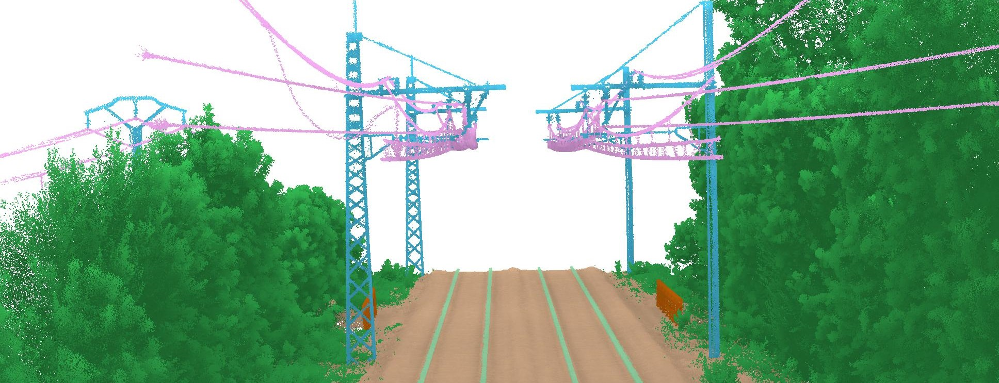

# 3D Point Cloud Essentials

## Table of Contents
1. [Introduction](#introduction)
2. [Tools and Software](#tools-and-software) 🛠️
3. [Courses and Tutorials](#courses-and-tutorials) 📚
4. [Lectures and Seminars](#lectures-and-seminars) 🎤
5. [Project Examples and Case Studies](#project-examples-and-case-studies) 💼
6. [Community and Networking](#community-and-networking) 🌐
7. [Books and Literature](#books-and-literature) 📖
8. [Contributing](#contributing) 👐

## Introduction

Welcome to "3D Point Cloud Essentials"! I've developed this repository as a comprehensive hub for anyone delving into the world of 3D point cloud technology. Whether you're a student, researcher, or industry professional, this repository aims to be your go-to resource. It encompasses a wide array of materials, including essential tools, foundational books, groundbreaking research papers, practical datasets, informative courses, and insightful lectures. The goal is to facilitate learning, research, and development in the dynamic field of 3D point clouds, providing resources that cater to various levels of expertise and interest.

### Open-Source Tools 🛠️
This section provides a comprehensive list of tools and software for 3D point cloud processing, covering a range of functionalities from acquisition and processing to analysis and visualization. Both open-source and commercial options are included to cater to diverse needs and preferences.

- **PCL (Point Cloud Library)**
  - A comprehensive library for 2D/3D image and point cloud processing.
  - [PCL GitHub](https://github.com/PointCloudLibrary/pcl)
  - [PCL Website](http://pointclouds.org/)

- **CloudCompare**
  - Specializes in 3D point cloud and mesh comparison and processing.
  - [CloudCompare GitHub](https://github.com/CloudCompare/CloudCompare)
  - [CloudCompare Website](http://www.cloudcompare.org/)

- **Open3D**
  - A toolkit for processing, visualizing, and analyzing 3D data.
  - [Open3D GitHub](https://github.com/intel-isl/Open3D)
  - [Open3D Website](http://www.open3d.org/)

- **PDAL (Point Data Abstraction Library)**
  - A C++ library for processing point cloud data.
  - [PDAL GitHub](https://github.com/PDAL/PDAL)
  - [PDAL Website](https://pdal.io/)

- **laspy**
  - A Python library for reading, modifying, and writing LAS files.
  - [laspy GitHub](https://github.com/laspy/laspy)

- **plyfile**
  - A Python library for reading and writing PLY files.
  - [plyfile GitHub](https://github.com/dranjan/python-plyfile)

- **MeshLab**
  - An open-source system for processing and editing 3D triangular meshes.
  - [MeshLab GitHub](https://github.com/cnr-isti-vclab/meshlab)
  - [MeshLab Website](http://www.meshlab.net/)

### Commercial Software

- **Leica Cyclone**
  - Comprehensive software for point cloud processing in various industries.
  - [Leica Cyclone](https://leica-geosystems.com/products/laser-scanners/software/leica-cyclone)

- **Autodesk Recap**
  - For 3D scanning and photogrammetry, creating 3D models from photographs and laser scans.
  - [Autodesk Recap](https://www.autodesk.com/products/recap/overview)

- **Faro Scene**
  - Processes and manages scanned data, mainly from FARO scanners.
  - [Faro Scene](https://www.faro.com/en/Products/3D-Surveying/FARO-SCENE)

### Visualization and Analysis

- **ParaView**
  - A multi-platform tool for data analysis and visualization.
  - [ParaView Website](https://www.paraview.org/)

- **Blender**
  - A free and open-source 3D creation suite for modeling, animation, and rendering.
  - [Blender Website](https://www.blender.org/)

### Data Acquisition

- **Agisoft Metashape**
  - Photogrammetric processing of digital images and 3D spatial data generation.
  - [Agisoft Metashape](https://www.agisoft.com/)

- **Pix4Dmapper**
  - Professional photogrammetry software for drone mapping.
  - [Pix4Dmapper](https://www.pix4d.com/product/pix4dmapper-photogrammetry-software)

## Courses and Tutorials 📚
A compilation of courses, tutorials, and lectures offering structured learning paths for all levels in 3D point cloud technology.

## Lectures and Seminars 🎤
Recorded lectures and seminars from field experts, providing insights into both industry trends and academic advancements.

## Project Examples and Case Studies 💼
Showcases of practical applications and projects that utilize 3D point cloud technology, offering real-world examples and case studies.

## Community and Networking 🌐

The field of 3D point cloud technology is enriched by a vibrant community of professionals, enthusiasts, and researchers. Engaging with these communities can be invaluable for learning, collaboration, and staying abreast of the latest developments. Here are some key forums and platforms for networking and discussion:

### Specific Forums

- **CloudCompare Forum**
  - A dedicated forum for users of CloudCompare, where you can discuss issues, share tips, and get help from fellow users.
  - [CloudCompare Forum](http://www.cloudcompare.org/forum/)

- **Laser Scanning Forum**
  - A hub for professionals, enthusiasts, and newcomers to discuss everything related to laser scanning, including 3D point cloud processing.
  - [Laser Scanning Forum](https://www.laserscanningforum.com/forum/)

### Broader Online Communities

- **LinkedIn Groups**
  - LinkedIn hosts various groups focused on 3D scanning, LiDAR, and point cloud technologies, providing a platform for professional networking and knowledge sharing.
  - Search for groups related to "3D Scanning", "LiDAR", and "Point Cloud Technology" on LinkedIn.

 
## Books and Literature 📖

The field of 3D point cloud technology is vast and intricate, requiring a solid understanding of various concepts and practices. This section lists books and literature that provide valuable insights and knowledge, beneficial for beginners and experts alike.

### Foundational Texts

- **"Computer Vision: Algorithms and Applications" by Richard Szeliski**
  - A comprehensive introduction to computer vision, including 3D point cloud data.
  - [Link to Book](https://www.springer.com/gp/book/9781848829343)

### Advanced Topics

- **"3D Deep Learning with Python" by Packt Publishing**
  - A hands-on guide to 3D deep learning, exploring PyTorch3D for processing 3D mesh and point cloud data.
  - [Link to Book](https://www.packtpub.com/product/3d-deep-learning-with-python/9781803247823)

- **"3D Point Cloud Analysis: Traditional, Deep Learning, and Explainable Machine Learning Methods" by Shan Liu, Min Zhang, Pranav Kadam, C.-C. Jay Kuo**
  - Comprehensive investigation of point cloud processing including traditional, deep learning, and explainable ML methods.
  - [Link to Book](https://link.springer.com/book/10.1007/978-3-030-89180-0)

- **"Reconstruction and Analysis of 3D Scenes: From Irregularly Distributed 3D Points to Object Classes" by Martin Weinmann**
  - Latest research on 3D point cloud generation, feature extraction, registration, and scene analysis.
  - [Link to Book](https://link.springer.com/book/10.1007/978-3-319-29246-5)

### Practical Guides

- **"3D Recording, Documentation and Management of Cultural Heritage" edited by Efstratios Stylianidis and Fabio Remondino**
  - Methods and technologies in 3D recording for managing and preserving cultural heritage.
  - [Link to Book](https://www.whittlespublishing.com/3D_Recording_Documentation_and_Management_of_Cultural_Heritage)

### Journals and Periodicals

- **ISPRS Journal of Photogrammetry and Remote Sensing**
  - A leading journal covering topics including point cloud processing.
  - [Journal Link](https://www.journals.elsevier.com/isprs-journal-of-photogrammetry-and-remote-sensing)

- **Photogrammetric Engineering & Remote Sensing (PE&RS)**
  - Articles and research on photogrammetry, remote sensing, and spatial information sciences.
  - [Journal Link](https://www.asprs.org/asprs-publications/pers)

This list is a starting point and is not exhaustive. Suggestions and contributions to this section are welcome.

## Contributing 👐

Your contributions are what make "3D Point Cloud Essentials" a dynamic and valuable resource. Whether it's suggesting new resources, updating existing ones, or providing feedback, I welcome your input. Let's collaborate to keep this repository a rich, accurate, and up-to-date resource for everyone in the 3D point cloud community.

Thank you for visiting and contributing to 3D Point Cloud Essentials!

